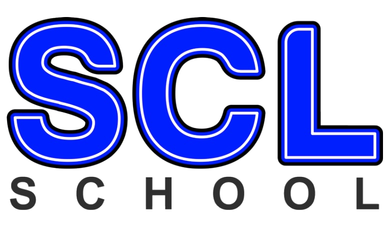

##  Batabit-1
  
  
 
## Portafolio

------------
- Portafolio III  de Producción de Contenidos Digitales 
-  SCL
-  Año 2021
----------------------
##### Anteportada
###### Colegio:
- Santa Catalina Laboure
###### Nombre:
- Deisi Asuceli Ruiz Socop
- Diego Eduardo Osorio Chunchún
###### Grado: 
- V Bachillerato en Ciencias y Letras con Orientación en Computación
###### Curso: 
- Producción de Contenidos Digitales
###### Profesor: 
- Jossue Emmanuel Fuentes
----------------------
#### Ìndice
- Portada
- Anteportada
- Índice
- Objetivos
- Documentación
	- Se encuentra variable de colores
	- Medidas Rem
	- Html
	- Css 
	- js. 
- Objetivos futuros

------------
##### Objetivos
- Analizar todo el procedimiento   de nuestro proyecto.
- Trabajar en equipo para generar un mejor entendimiento.
- Practicar en todas las actividades para generar mejor conocimiento.

------------
#### Documentación
###### Section1y2
- Trabajado por Diego Eduardo Osorio Chunchún
- Se realiza la primera parte del wiframe donde se utilizan medidas rem y el código de colores
###### Section3y4
- Trabajado por Deisi Asuceli Ruiz Socop
- Se realiza la tercera section con el cual se utilizó  las medidas rem y iconos.
- También la cuarta la cual consiste en   los cuadros de pago.
- Y la ultima la cual se enfoca en el footer.
- La redacción  del README.
###### Link del figma.
 # https://www.figma.com/file/sMmlQaZldfDcLERYYWe6h4/Bata-Bit?node-id=359%3A154
###### Link Proyecto.
# https://oreo-beep.github.io/Batabit-1/
------------
##### Objetivos futuros 
- Establecer un horario justo para tener un mejor organizacion.
- Investigar lo necesario para disminuir los problemas que surgen en el camino. 
- Trabaja con mejores tecnica para entregar un trabajo formal.
